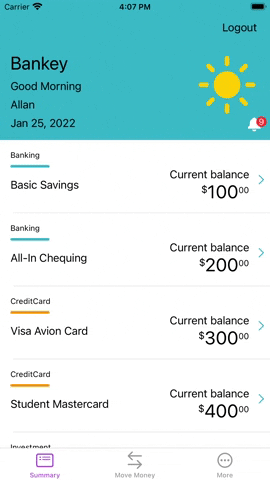
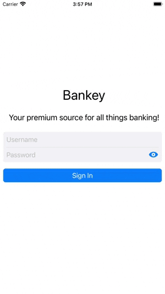

# AccountSummary

The first screen from __[MainViewController](https://github.com/fserrazes/Bankey/blob/master/Bankey/MainViewController.swift)__.
Represents the __[AccountSummaryViewController](https://github.com/fserrazes/Bankey/blob/master/Bankey/Account%20Summary/AccountSummaryViewController.swift)__, which contains information about the client's accounts on his bank account. The account data comes from the network.

## Features

### TableViewCell, TableHeaderView

In order to make the table more informative, we have implemented 2 custom elements for the table's header and cell:

+ __[AccountSummaryHeaderView](https://github.com/fserrazes/Bankey/blob/mastern/Bankey/Account%20Summary/Header/AccountSummaryHeaderView.swift)__ - The table header is implemented using an xib file.
+ __[AccountSummaryCell](https://github.com/fserrazes/Bankey/blob/master/Bankey/Account%20Summary/Cells/AccountSummaryCell.swift)__ - The table cell is implemented programmatically.

These classes have additional __(viewModel)__, representations, which create models with the data to be displayed, which are placed in the corresponding class, relieving it of unnecessary responsibility.

### CurrencyFormatter

To display the balance of accounts in the account is also applied custom solution in the form of a structure __[CurrencyFormatter](https://github.com/fserrazes/Bankey/blob/master/Bankey/Utils/CurrencyFormatter.swift)__.

### Networking

n the table's grid, the client's profile data is displayed, and in the cell the data about a particular client's account is displayed. They are taken from the same JSON file, but by 2 different URLs.
That's why the work with the network is divided into two parts, getting the profile and getting the account by its id. __[ProfileManager](https://github.com/fserrazes/Bankey/blob/master/Bankey/Account%20Summary/Networking/ProfileManager.swift)__, __[Extension for AccountSummaryViewController](https://github.com/fserrazes/Bankey/blob/master/Bankey/Account%20Summary/AccountSummaryViewController%20%2B%20Networking.swift)__ (fetch Accounts).

    The ProfileManageable protocol that ProfileManager subscribes to is
     needed to create a mock object for testing (see UnitTests).

When working with a network, it also uses __GCD__, __DispatchQueue.main.async__ to display the received data in the main stream and __DispatchGroup__ for synchronous display of data in the header and cell when loading and refreshing the data.

### UIRefreshControl

For this screen, it is possible to retrieve data from a random user (1 of 4) by updating the data via __UIRefreshControl__.

### ErrorAlert
If an error occurs when downloading data from the network, the alertController will notify the user of problems with receiving data or a network failure.

A specific name and message will be shown for each error. The error type is contained in the enumeration __NetworkError__.

