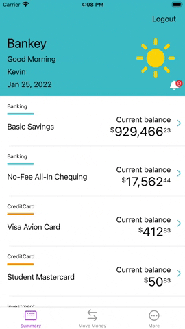
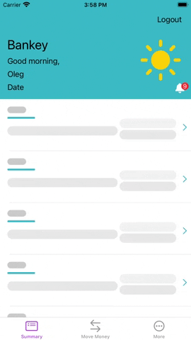

# Animations

## Animated objects in the application

+ A small bell in the headerView of the main screen table. Animation happens every time you click on the object.
+ Shimmering "wireframe" view for the displayed data in the table cell. It can be seen when data is downloaded from the network for a long time, when errors appear or when refreshControl takes a long time.

## Implementation of animations

### ShakeyBell
A separate __ShakeBellView__ class is created for the animated bell in the Components directory.
The animated object is a __UIImageView__, for which a click action is added using __UITapGestureRecognizer__.
The animation is 6 displacements of 22.5 (-22.5) degrees for 1.0 second relative to __imageView.setAnchorPoint(CGPoint(x: 0.5, y: 0.0))__.

### SkeletonView

SkeletonView is an additional view that essentially replicates the AccountSummaryCell.
It appears only in case of network errors or long data loading. Animated in this version is a change of color __CAGradienLayer__, which is added to each label. It is implemented using __CAAnimationGroup__, __CABasicAnimation__ and a method in the __SkeletonLoadable__ protocol to which the __[SkeletonCell](https://github.com/fserrazes/BankeyApp/blob/master/BankeyApp/AccountSummary/Cells/SkeletonCell.swift)__ class will subscribe.
For the effect of color change mismatch, the start of each next object's animation will be 0.33 seconds later.
