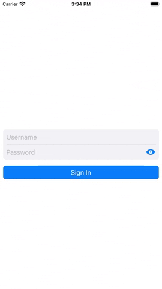
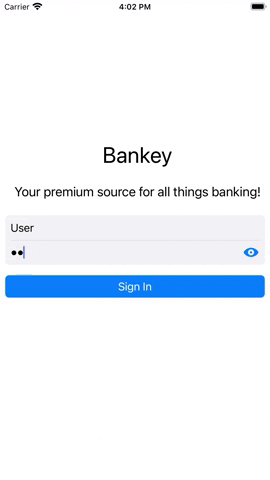
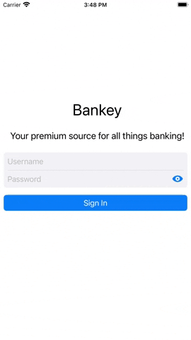

# LoginView

The start screen for logging into the application. For quick access, you do not need to enter a password and login.

### Features

+ Header animation when appearing
+ Ability to show the text of the password to be entered
+ Login button animation when clicked with empty fields or invalid data
+ If you enter an empty field or incorrect data, corresponding messages will be displayed
+ After your first login, an OnboardingView will appear with additional information about the app
+ Next time you login to the application, the main screen will appear immediately

