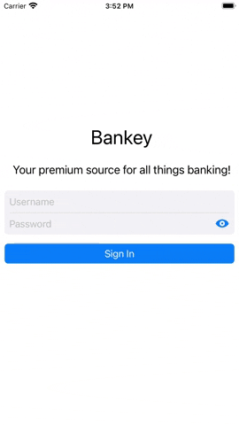

# OnboardingView

The screen is a container of additional information that appears the first time you start the application.

### Features.

To implement __Onboarding__, the __ContainerViewController__ class is reimplemented, in which you can substitute the desired image and description, when you create an instance of this class.
The "container" itself is implemented in the __OnboardingContainerViewController__ class using __UIPageViewController__, with 3 instances of the __ContainerViewController__ class added to it.
See the code for details __[here](https://github.com/fserrazes/Bankey/blob/master/Bankey/Onboarding/OnboardingContainerViewController.swift).__

Navigation is done in 3 ways:
+ Dot menu at the bottom
+ Next, back, close and done buttons
+ Swipes across the screen

You can close and get to the main screen with the close button or the done button on the last Onboarding screen

